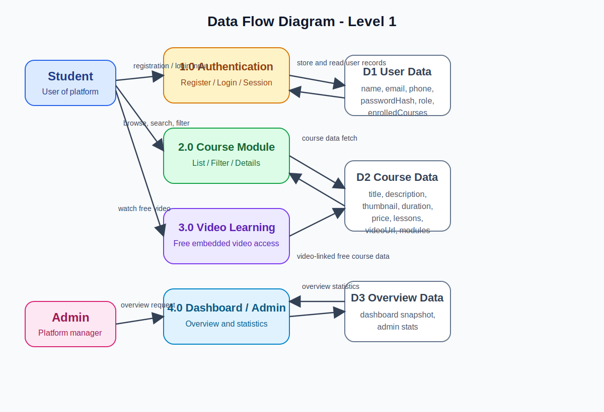

# BCA Final Year Dissertation Report
## E-Learning Platform

**Formatting Note:**  
This report is written in a format suitable for **Times New Roman**, **Font Size 12**, and **1.5 line spacing** in MS Word as per the general dissertation guidelines of Mangalayatan University.

---

# TITLE PAGE

## E-LEARNING PLATFORM

### A DISSERTATION

Submitted in partial fulfillment of the requirements for the award of the degree of

## BACHELOR OF COMPUTER APPLICATIONS

### By

**Sandeep Paswan**  
**Enrollment No.: 20231224**

### Supervisor

**Ms. Shanu Gupta**

### Department of Computer Engineering and Applications (DCEA)  
### Faculty of Engineering and Technology  
### Mangalayatan University, Beswan  

### May 2026

---

# CERTIFICATE

This is to certify that the dissertation entitled **“E-Learning Platform”** submitted by **Sandeep Paswan (Enrollment No. 20231224)** in partial fulfillment of the requirements for the award of the degree of **Bachelor of Computer Applications** to the **Department of Computer Engineering and Applications (DCEA), Faculty of Engineering and Technology, Mangalayatan University, Beswan** is a bonafide record of work carried out by him under my guidance and supervision.

It is further certified that this work has not been submitted elsewhere for the award of any other degree or diploma.

**Supervisor**  
Ms. Shanu Gupta  

**Signature:** ____________________  

Date: ____________________  

---

# DECLARATION

I hereby declare that the dissertation report entitled **“E-Learning Platform”** submitted in partial fulfillment of the requirements for the award of the degree of **Bachelor of Computer Applications** is my original work.

I further declare that the work presented in this dissertation has been completed by me under the guidance and supervision of my project supervisor. This dissertation has not been submitted earlier to this university or any other university for the award of the **Bachelor of Computer Applications** degree.

I also declare that all sources of information used in this dissertation have been properly acknowledged.

**Submitted by:**  
Sandeep Paswan  
Enrollment No.: 20231224  

**Signature:** ____________________  
Date: ____________________  

---

# APPROVAL SHEET

This dissertation entitled **“E-Learning Platform”** submitted by **Sandeep Paswan (Enrollment No. 20231224)** is approved for the degree of **Bachelor of Computer Applications**.

**Examiners**

1. ____________________  
2. ____________________  

**Supervisor**  
Ms. Shanu Gupta  
Signature: ____________________  

**Chairman / Head of Department**  
____________________  
Signature: ____________________  

Date: ____________________  
Place: ____________________  

---

# ACKNOWLEDGEMENT

I express my sincere gratitude to my respected supervisor **Ms. Shanu Gupta** for her valuable guidance, encouragement, and continuous support throughout the development of this project. Her suggestions and academic direction helped me understand the practical and theoretical aspects of software development in a better way.

I am thankful to the **Department of Computer Engineering and Applications (DCEA), Faculty of Engineering and Technology, Mangalayatan University** for providing me the opportunity to work on this dissertation and improve my technical skills.

I would also like to thank my teachers, classmates, and friends for their motivation and support. Their discussions and suggestions helped me during the implementation and preparation of this report.

Finally, I am deeply thankful to my family members for their constant encouragement, patience, and emotional support during the completion of this project.

---

# ABSTRACT

The rapid growth of internet technologies has transformed the education sector and created new opportunities for online learning. Today, students prefer educational platforms that are flexible, accessible, and easy to use. The project titled **“E-Learning Platform”** has been developed with the aim of creating a modern web-based educational system where users can register, log in, explore courses, view learning content, and access video-based lessons through an organized digital interface.

This project is a full-stack web application developed using a **React frontend** and **Node.js with Express backend**. The overall development approach follows a MERN-oriented structure and also supports a database-ready architecture using **MongoDB and Mongoose**. One special implementation feature of the project is that it can work even when the database is not connected. In such cases, the application uses **fallback sample data** stored in the backend. This improves project reliability during demonstration and academic evaluation.

The system contains several modules such as **user registration**, **user login**, **course listing**, **course detail page**, **free video learning module**, **student dashboard**, **profile management**, **project showcase page**, and **admin overview panel**. The platform supports both **free** and **paid** courses. In free courses, the user can watch embedded videos directly on the course detail page without leaving the website. This improves usability and gives the project a realistic e-learning experience.

The frontend has been designed with attention to navigation, layout, responsiveness, and visual clarity. Important pages implemented in the project include **Home**, **Login**, **Register**, **Courses**, **Course Details**, **Dashboard**, **Profile**, **Projects**, **Project Details**, and **Admin Panel**. The home page promotes featured learning tracks such as **Frontend UI Engineering** and **Data Analytics with Python**. The course listing page allows users to search courses and filter them into free and paid categories.

The backend provides a set of REST-style APIs for handling authentication, course access, dashboard overview data, enrollment logic, and admin statistics. The project supports role-based behavior, where a normal student is redirected to the course section after login, while an admin is redirected to the admin panel. The profile page also displays actual user-related information such as name, email, phone number, role, enrolled course count, and image preview.

The objective of this project is not only to build a functional website, but also to demonstrate practical understanding of modern software development concepts such as route management, API integration, state handling, user authentication, and modular code design. It also reflects the importance of educational software systems in present-day society, where online content delivery has become a major part of learning.

This dissertation explains the need for the system, compares it with existing platforms, discusses its modules and implementation details, presents diagrams, and evaluates the final outcome through testing and analysis. The E-Learning Platform is a practical and meaningful student project, and it can be extended in future with advanced features such as online payments, quizzes, certificates, live classes, and cloud deployment.

In conclusion, this project successfully meets its purpose as a university-level BCA final year dissertation. It combines technical implementation with academic structure and provides a strong foundation for future enhancements in the field of digital learning platforms.

---

# TABLE OF CONTENTS

1. Title Page  
2. Certificate  
3. Declaration  
4. Approval Sheet  
5. Acknowledgement  
6. Abstract  
7. Table of Contents  
8. List of Figures  
9. List of Tables  
10. Abbreviations  
11. Chapter 1: Introduction  
12. Chapter 2: Literature Survey  
13. Chapter 3: Problem Statement and System Analysis  
14. Chapter 4: System Design  
15. Chapter 5: Technology Used  
16. Chapter 6: Modules Description  
17. Chapter 7: Implementation  
18. Chapter 8: Testing  
19. Chapter 9: Results and Discussion  
20. Chapter 10: Advantages and Limitations  
21. Chapter 11: Future Scope  
22. Chapter 12: Conclusion  
23. Chapter 13: References  

---

# LIST OF FIGURES

1. Figure 1: Home Page Hero Section  
2. Figure 2: Login Page  
3. Figure 3: Registration Page  
4. Figure 4: Courses Page Banner  
5. Figure 5: Project Section Preview  
6. Figure 6: Data Flow Diagram Level 1  

---

# LIST OF TABLES

1. Table 1: Comparison of Existing Learning Systems  
2. Table 2: Functional Requirements  
3. Table 3: Non-Functional Requirements  
4. Table 4: Technology Stack  
5. Table 5: Module Summary  
6. Table 6: Test Cases and Results  
7. Table 7: Advantages and Limitations  

---

# ABBREVIATIONS

- BCA – Bachelor of Computer Applications  
- UI – User Interface  
- UX – User Experience  
- API – Application Programming Interface  
- MERN – MongoDB, Express, React, Node.js  
- DFD – Data Flow Diagram  
- ER Diagram – Entity Relationship Diagram  
- DB – Database  
- HTML – HyperText Markup Language  
- CSS – Cascading Style Sheets  
- JS – JavaScript  
- CRUD – Create, Read, Update, Delete  

---

# CHAPTER 1: INTRODUCTION

## 1.1 Overview of E-Learning

E-learning refers to the use of digital systems and internet technology to provide learning material, educational services, and academic guidance to students. In the traditional classroom method, students depend on fixed class timings, physical presence, handwritten notes, and face-to-face interaction. However, in modern times, learning has moved significantly toward online platforms where students can access resources from any place and at any time.

An e-learning system generally includes features such as course access, video learning, user registration, study content, progress overview, and digital communication. These platforms are helpful for school students, college students, professional learners, and anyone who wants to continue learning in a flexible manner.

The present project, **E-Learning Platform**, is a web-based educational system developed to provide students with a structured digital environment for learning. It has been designed to show how a student can register, log in, browse courses, access course details, and watch selected free videos inside the platform. It also supports role-based access where an admin can log in and view platform statistics.

This project is important because it demonstrates how full-stack web technologies can be used to solve a real-world educational requirement. It combines frontend user interaction, backend APIs, and data management into one practical academic project.

## 1.2 Importance and Need of the Project

The need for an e-learning platform can be understood from both educational and technical perspectives.

### Educational Need

- Students need flexible learning options.
- Many learners prefer to study at their own speed.
- Educational materials should be available from a single platform.
- Video content is easier to understand than only text notes.
- Online learning is useful for revision and self-study.

### Technical Need

- Educational institutions are moving toward digitization.
- Web-based systems are easier to access from multiple devices.
- Course-related information can be updated more efficiently online.
- User accounts help in organizing student learning records.

### Project-Specific Need

In many cases, students depend on multiple disconnected tools such as:
- YouTube,
- messaging apps,
- shared documents,
- and separate websites.

This creates confusion and weakens the learning experience. Therefore, a single integrated platform is useful. The E-Learning Platform was created to solve this issue by offering:
- course browsing,
- student identity,
- embedded learning videos,
- and admin overview features.

## 1.3 Objectives of the Project

The objectives of this project are:

1. To develop a web-based e-learning system for students.
2. To provide a secure registration and login process.
3. To build a course library with free and paid courses.
4. To support filtering and searching of course content.
5. To provide detailed course pages.
6. To embed video lessons for selected free courses.
7. To provide a learner dashboard and profile page.
8. To design an admin overview section.
9. To create a project that is academically strong and practically useful.
10. To provide a foundation for future features such as payments, live classes, and quizzes.

---

# CHAPTER 2: LITERATURE SURVEY

## 2.1 Study of Existing Systems

Before developing the proposed system, it is necessary to study popular existing e-learning platforms.

### Udemy

Udemy is one of the largest online learning marketplaces. It offers thousands of paid and free courses. Users can purchase courses and watch recorded content. It supports course reviews, instructor profiles, and self-paced learning.

### Coursera

Coursera offers university and industry-level courses. It is known for professional certification, structured programs, and academic tie-ups. It is more formal and is often used for career-based learning.

### Khan Academy

Khan Academy is a free education platform that provides concept-based learning videos and practice. It is highly useful for school-level and foundation-level learning.

### Unacademy

Unacademy is widely used for exam preparation. It focuses on live and recorded lectures for competitive exams, structured batches, and subscription-based access.

### YouTube Learning Channels

YouTube has a large amount of educational content. It is easily accessible and free. However, it is not a proper learning management platform because it lacks structured user modules, course grouping, and platform-based progress flow.

## 2.2 Comparison of Existing Systems

| Platform | Major Strength | Limitation |
|---|---|---|
| Udemy | Large number of courses | Mostly paid content |
| Coursera | Structured academic programs | Higher complexity for beginners |
| Khan Academy | Free and concept-based | Limited to certain types of learning |
| Unacademy | Strong exam-focused content | Subscription dependency |
| YouTube | Easy video availability | No structured course management |

## 2.3 Limitations of Current Platforms

Although existing systems are useful, they still have some limitations from the viewpoint of a student-level or custom academic platform:

- They may be expensive for regular learners.
- They may provide too many advanced features for small users.
- Some platforms are not easy to customize.
- Educational videos may exist, but full platform integration may not.
- Free learning is often mixed with advertisements or distractions.

## 2.4 Motivation Behind the Proposed System

The proposed E-Learning Platform has been inspired by these systems but is designed to remain:

- simpler,
- more focused,
- easier to explain academically,
- and better suited for a university project.

It combines selected practical features such as login, profile, free videos, courses, and admin access into one manageable project structure.

---

# CHAPTER 3: PROBLEM STATEMENT AND SYSTEM ANALYSIS

## 3.1 Problem Statement

Traditional learning methods often create problems for students because:

- notes are not centrally available,
- learning videos are scattered across different platforms,
- students do not get a unified interface,
- course exploration is difficult,
- and there is no single system to combine learning and access control.

Even when learning is available online, many systems are either too complex, too expensive, or not tailored to the specific needs of a learner. Therefore, there is a need for a platform that is simple, visually attractive, and educationally useful.

## 3.2 Existing System

In the existing setup, students depend on:

- classroom instruction,
- printed notes,
- shared files,
- YouTube links,
- and social communication tools.

This approach has limitations such as:

- no centralized course list,
- no structured dashboard,
- no user-specific profile,
- weak content organization,
- and no role-based management.

## 3.3 Proposed System

The proposed E-Learning Platform is a centralized solution where:

- students can register and log in,
- all courses are visible in one platform,
- courses can be filtered as free or paid,
- course details are available on separate pages,
- free course videos can be watched inside the same website,
- users can access profile and dashboard pages,
- admin can see an overview section.

## 3.4 Advantages of Proposed System

- Centralized educational content
- Better visual presentation
- User authentication support
- Student and admin separation
- Search and filter capability
- Embedded free course videos
- Easy future expansion
- Database-ready design

## 3.5 Functional Requirements

| Requirement Code | Requirement |
|---|---|
| FR1 | User registration |
| FR2 | User login |
| FR3 | Course listing |
| FR4 | Course searching |
| FR5 | Free/paid filtering |
| FR6 | Course details access |
| FR7 | Embedded free video viewing |
| FR8 | Admin statistics access |
| FR9 | Profile page with user details |
| FR10 | Dashboard display |

## 3.6 Non-Functional Requirements

| Requirement Code | Requirement |
|---|---|
| NFR1 | Responsive interface |
| NFR2 | Easy navigation |
| NFR3 | Attractive layout |
| NFR4 | Reliable backend response |
| NFR5 | Academic demonstration support |
| NFR6 | Expandable system architecture |

---

# CHAPTER 4: SYSTEM DESIGN

## 4.1 Architecture of the System

The architecture of the E-Learning Platform follows a layered client-server design.

### Frontend Layer

The frontend is built with React and is responsible for:
- rendering pages,
- handling route navigation,
- managing UI events,
- sending API requests,
- and storing authentication session details.

### Backend Layer

The backend is built with Express.js and handles:
- user registration,
- user login,
- current user retrieval,
- course list and course details,
- enrollment data,
- and admin overview.

### Data Layer

The data layer is based on MongoDB through Mongoose models. However, the project also includes fallback sample data. This allows the system to remain usable even without live database connectivity.

### Text-Based Architecture Diagram

```text
Student / Admin
      |
      v
React Frontend
(Home, Login, Register, Courses, Dashboard, Profile, Admin)
      |
      v
Axios API Requests
      |
      v
Express Server
(Auth Routes, Course Routes, Admin Routes)
      |
      v
MongoDB / Fallback Sample Data
```

## 4.2 Use Case Diagram (Text Format)

### Actors
- Student
- Admin

### Student Use Cases

```text
Student
  -> Register
  -> Login
  -> Browse Home
  -> Search Courses
  -> Filter Free/Paid Courses
  -> View Course Detail
  -> Watch Free Video
  -> Open Profile
  -> View Dashboard
```

### Admin Use Cases

```text
Admin
  -> Login
  -> Open Admin Panel
  -> View Statistics
```

## 4.3 Data Flow Diagram (DFD)

The DFD explains how data moves through the system between users, processes, and stored data.

### DFD Image



### DFD Explanation

- The student sends registration or login data to the authentication module.
- The authentication module interacts with user data storage.
- The student browses course information through the course module.
- The course module retrieves course data and free video links.
- The admin requests statistics from the overview module.
- The dashboard and admin data are served from backend logic and stored data.

## 4.4 ER Diagram (Text Format)

```text
ENTITY: USER
- id
- name
- email
- phone
- passwordHash
- role
- enrolledCourses

ENTITY: COURSE
- id
- slug
- title
- description
- instructor
- thumbnail
- duration
- level
- category
- price
- rating
- students
- lessons
- highlights
- modules
- videoUrl
- videoTitle

RELATIONSHIP:
USER enrolls in COURSE
```

## 4.5 Flowchart

```text
Start
  |
  v
Open Home Page
  |
  v
If New User? ---- Yes ----> Register
  |                         |
  No                        v
  |                     Account Created
  v                         |
Login ----------------------|
  |
  v
Check Role
  |
  +---- Student ----> Courses Page ----> Open Course ----> Watch Free Video / Buy Course
  |
  +---- Admin ------> Admin Panel -----> View Overview
  |
  v
Open Profile / Dashboard
  |
  v
End
```

---

# CHAPTER 5: TECHNOLOGY USED

## 5.1 HTML

HTML is the basic markup technology used in the project through JSX in React. It is used to create:
- forms,
- sections,
- headings,
- navigation blocks,
- and content containers.

## 5.2 CSS

The project uses **Tailwind CSS** for styling. It helps in:
- spacing,
- font styling,
- color design,
- responsiveness,
- shadows,
- rounded cards,
- and layout composition.

## 5.3 JavaScript

JavaScript is the main programming language of the project. It is used in both frontend and backend.

### Frontend JavaScript
- form handling
- route navigation
- API calling
- conditional rendering
- state handling

### Backend JavaScript
- route creation
- authentication logic
- validation
- response generation
- fallback data support

## 5.4 Database

The database design is prepared using **MongoDB** with **Mongoose** models:
- `User`
- `Course`

In the absence of database connectivity, the project uses:
- `sampleUsers.js`
- `sampleCourses.js`

This fallback mode is very useful in project demonstration.

## 5.5 Tools and Software Used

| Tool / Software | Purpose |
|---|---|
| VS Code | Code editing |
| React | Frontend development |
| Vite | Frontend build tool |
| Node.js | Runtime environment |
| Express.js | Backend server |
| MongoDB | Database |
| Mongoose | ODM for database models |
| Tailwind CSS | Styling |
| Axios | API communication |
| Git / GitHub | Version control |
| Browser | Application testing |

## 5.6 Technology Stack Summary

| Category | Technology Used |
|---|---|
| Frontend | React, React Router DOM, Axios, Tailwind CSS |
| Backend | Node.js, Express.js |
| Database | MongoDB, Mongoose |
| Authentication | Token-based session with local storage |
| Images/Media | Remote image URLs and embedded YouTube video links |

---

# CHAPTER 6: MODULES DESCRIPTION

## 6.1 User Module

The user module is one of the most important parts of the project. It manages all student-side activity.

### Main Features
- New user registration
- Existing user login
- Session management
- Role-based redirect
- Profile access

### Description

The system allows a new user to create an account by entering name, email, and password. After registration, the user is redirected to the courses page. Existing users can log in and access course content. The frontend stores session information in local storage so that the platform can remember the user.

## 6.2 Admin Module

The admin module is designed for administrative access.

### Main Features
- admin login
- role verification
- statistics overview

### Description

When an admin logs in, the system redirects to the admin panel. The admin panel displays overview statistics such as total courses, users, and admins. This module can be expanded in future to include course creation, editing, deleting, and user management.

## 6.3 Course Module

The course module is the content core of the project.

### Main Features
- course list display
- course search
- category information
- free and paid separation
- course detail view

### Description

Courses are fetched from backend APIs. Each course contains data such as title, slug, description, instructor, level, duration, category, price, rating, students, lessons, highlights, and modules.

The course page allows filtering using:
- free courses
- paid courses

This gives users better content organization.

## 6.4 Video Learning Module

The video learning module supports educational video access for selected free courses.

### Main Features
- embedded free video section
- internal video access
- related free course display

### Description

Free courses such as:
- React Interview Prep
- Freelancing Career Starter
- AI Tools for Productivity

contain video links. These are converted into embedded players and shown directly inside the course details page. This means the student remains on the learning platform while watching the lesson.

## 6.5 Dashboard Module

The dashboard module gives a visual learning experience.

### Main Features
- greeting section
- course stats
- test series visual area
- recent activity
- live class section

### Description

This module presents a modern dashboard layout using a sidebar and overview cards. It gives the learner a sense of structured platform access and makes the project visually stronger.

## 6.6 Profile Module

The profile module is used to display and personalize student details.

### Main Features
- name, email, phone, role
- enrolled courses count
- local image upload preview
- quick navigation links

### Description

The profile page reads user information from the authentication context. It allows a learner to view their account information and upload a profile image preview that is stored locally in the browser.

## 6.7 Module Summary Table

| Module | Purpose |
|---|---|
| User Module | Registration, login, session, access |
| Admin Module | Statistics and platform control overview |
| Course Module | Course listing and details |
| Video Module | Free video learning |
| Dashboard Module | Learning summary view |
| Profile Module | User details and personalization |

---

# CHAPTER 7: IMPLEMENTATION

## 7.1 Home Page

The home page is the landing page of the application. It contains:

- top navigation bar,
- promotional hero section,
- rotating slide logic,
- attractive banners,
- popular courses section,
- and navigation to course-related actions.

The home page visually presents featured learning tracks like:
- Frontend UI Engineering
- Data Analytics with Python

It is designed to attract users and guide them toward course exploration.

**Figure 1: Home Page Hero Section**  


## 7.2 Login Page

The login page includes:
- email field
- password field
- remember me option
- error message area
- direct link to registration page

The page uses the frontend authentication context and sends user credentials to the login API. After successful login:
- admin goes to `/admin`
- student goes to `/courses`

**Figure 2: Login Page**  


## 7.3 Register Page

The registration page contains:
- full name input
- email input
- password input
- submit button
- error handling

After successful registration, the user is redirected to the course page. This implementation improves the onboarding flow because the user can immediately start exploring the learning content.

**Figure 3: Registration Page**  


## 7.4 Course List Page

The course list page loads courses from backend through the API layer. It includes:
- page heading
- search support
- free course filter
- paid course filter
- statistics panel
- course cards in grid format

Each course card displays:
- course category
- title
- short description
- instructor
- rating
- price status
- action button

**Figure 4: Courses Page Banner**  


## 7.5 Course Detail Page

The course detail page is one of the most feature-rich pages of the project.

It shows:
- course category
- level
- title
- description
- lessons count
- learners count
- rating
- highlights
- modules
- instructor
- duration

For free courses, it also shows the embedded video section.

## 7.6 Video Learning Page

In this project, the video learning page is integrated into the course detail page rather than as a separate route. This approach keeps the user in the same context while accessing video lessons.

Free course videos are embedded directly into the page, which improves the overall user experience.

## 7.7 Dashboard

The dashboard is visually designed as a student panel. It includes:
- left sidebar
- welcome section
- statistics cards
- mock banner
- recent activity
- simple graph-like visual blocks

This module makes the project look more complete and professional.

## 7.8 Admin Panel

The admin panel is accessible only to admin users. It performs:
- authentication role checking
- platform overview display

The page includes summary statistics and future module suggestions, showing that the project is ready for expansion.

## 7.9 Profile Page

The profile page displays:
- initials or profile image
- name
- email
- phone
- role
- enrolled course count
- status
- quick links

This page improves user personalization.

## 7.10 Projects and Project Detail Page

The project module is an additional practice-based section that shows:
- project image
- project category
- description
- detail page link

This feature strengthens the learning platform by connecting theory with practical implementation ideas.

**Figure 5: Project Section Preview**  


---

# CHAPTER 8: TESTING

## 8.1 Unit Testing

In software development, unit testing checks whether individual functions or small parts of the system work correctly. In this project, unit-level checking includes:

- input validation logic,
- registration validation,
- login validation,
- video URL handling,
- filtering logic for free and paid courses.

## 8.2 Integration Testing

Integration testing checks whether different modules work together correctly. In this project, the following integrations were tested:

- frontend registration form with backend registration API,
- frontend login form with backend login API,
- frontend courses page with course API,
- profile page with auth context,
- admin page with admin overview API.

## 8.3 System Testing

System testing checks the complete project as a whole. This includes:

- opening the website,
- registering a user,
- logging in,
- navigating to courses,
- opening a course detail page,
- watching a free lesson,
- visiting profile,
- and checking admin overview.

## 8.4 Test Cases and Results

| Test Case ID | Test Description | Expected Result | Actual Result | Status |
|---|---|---|---|---|
| TC1 | Open home page | Home page loads | Loaded correctly | Pass |
| TC2 | Register new user | New user created | User created and redirected | Pass |
| TC3 | Login as student | Redirect to courses | Redirect successful | Pass |
| TC4 | Login as admin | Redirect to admin page | Redirect successful | Pass |
| TC5 | Search course by keyword | Matching courses displayed | Matching results shown | Pass |
| TC6 | Filter free courses | Only free courses shown | Filter successful | Pass |
| TC7 | Open free course detail | Video section displayed | Displayed correctly | Pass |
| TC8 | Open profile page | User details visible | Visible correctly | Pass |
| TC9 | Open admin as student | Access warning shown | Restriction successful | Pass |
| TC10 | Load dashboard data | Dashboard content visible | Data loaded | Pass |

## 8.5 Result of Testing

The testing process shows that the core modules of the project are functioning correctly. The integration between frontend and backend is successful. The application behaves as expected for both student and admin flows.

---

# CHAPTER 9: RESULTS AND DISCUSSION

The final output of the project is a complete educational web platform with multiple connected pages and practical functionality. The system successfully supports:

- landing page presentation,
- user registration,
- user login,
- course browsing,
- free course video access,
- dashboard display,
- profile view,
- admin statistics.

The developed system was tested as a working full-stack website and the final result shows that the project performs its basic academic objectives successfully. The frontend and backend communicate properly, the routes open as expected, and the user is able to move through the learning process in a clear sequence. A new user can register, log in, open the course library, view individual course pages, and access learning-related content without difficulty. This confirms that the overall application flow is stable and suitable for final year project demonstration.

One important result of the project is the successful separation of **student-side** and **admin-side** functionality. Normal users are redirected to the course section after login, while admin users are redirected to the admin panel. This role-based behavior improves the structure of the platform and shows practical implementation of access control. In a university project, such a feature is important because it demonstrates that the system is not just a static website, but a functional application with controlled user behavior.

The project also gives a useful result in the area of **course organization**. Courses are displayed with proper information such as title, instructor, category, rating, lessons, and price. The free and paid course separation helps users understand available learning options more easily. The search and filter features further improve the usability of the platform. This means the system is not only technically working, but also meaningful from the user’s point of view.

Another strong outcome of the project is the implementation of the **free video learning model**. Instead of only showing course names, selected free courses provide embedded video support inside the website. This makes the system more interactive and realistic. It also improves the educational value of the application because the user can directly access lesson-related content without leaving the platform. This feature increases the practical usefulness of the project and makes it closer to modern digital learning websites.

The **dashboard and profile modules** also contribute positively to the final result. The dashboard presents a structured learner interface with cards, activity sections, and visual blocks. The profile page shows user details such as name, email, role, and enrolled course count. The image upload preview on the profile page adds a personalized touch to the system. These modules improve the appearance and completeness of the platform and make the project more impressive in academic evaluation.

From the backend perspective, the APIs for authentication, course retrieval, dashboard data, and admin statistics are organized properly. The system also supports fallback sample data when a live database is not connected. This is a valuable result because it ensures that the project can still be demonstrated successfully during viva or lab presentation even if the database is unavailable. In this way, the project becomes more reliable and easy to handle in academic situations.

The project demonstrates a useful integration of frontend and backend technologies. It is visually strong enough for final year presentation and technically meaningful enough for academic discussion.

A major result of this system is that it gives a simplified but realistic model of a modern e-learning website. It helps the learner understand how course data, user roles, and digital educational content can be managed in one application.

From an academic point of view, the project is highly valuable because it covers:
- system design,
- API integration,
- route handling,
- data structure,
- authentication,
- and responsive UI concepts.

The discussion of the project also shows that the current implementation is a strong base for future expansion. Features such as live classes, online payment, course enrollment tracking, certificates, quiz systems, and cloud deployment can be added later without changing the complete structure of the application. Therefore, the result of this project is not limited only to the present scope; it also provides a strong foundation for advanced development in future.

Overall, the project can be considered successful both technically and academically. It solves a practical problem, uses modern web technologies, provides a good user experience, and demonstrates the real application of BCA-level software engineering concepts.

---

# CHAPTER 10: ADVANTAGES AND LIMITATIONS

## 10.1 Advantages

The E-Learning Platform provides several academic as well as practical advantages. These advantages make the project not only technically useful but also relevant for modern educational requirements.

### 1. Attractive and User-Friendly Interface

One of the major advantages of the project is its attractive and easy-to-understand user interface. The pages have been designed in a clean and modern style so that users can move from one section to another without confusion. A well-designed interface is important in e-learning because it improves user engagement and helps learners focus on the content rather than struggling with navigation.

### 2. Structured Course Library

The system presents courses in a structured format. Each course is shown with title, category, duration, instructor, rating, lessons, and price. This helps students compare different courses and understand the learning options clearly. It also gives the project a realistic course-platform behavior.

### 3. Free and Paid Course Separation

The platform supports separation of free and paid courses. This is a useful feature because learners can directly identify which content is free and which content requires payment or enrollment. It improves clarity and user convenience.

### 4. Embedded Free Video Learning

For selected free courses, the system supports embedded video lessons inside the website. This is one of the strongest practical advantages of the project. The user does not need to leave the platform for basic video learning. This provides a more continuous and comfortable learning experience.

### 5. Student and Admin Role Support

The system provides separate flows for student users and admin users. Students are redirected to the course section after login, while admins are redirected to the admin panel. This role-based separation improves system security, management, and practical value.

### 6. Profile Management Facility

The profile page allows the user to view personal details such as name, email, phone number, role, and enrolled course count. The user can also upload a profile image preview. This makes the system more personalized and interactive.

### 7. Dashboard-Based Learning Experience

The dashboard gives the platform a more complete educational feel. It provides a visual summary of learner-related information, recent activity, and progress-style content blocks. This makes the system more professional and attractive for project presentation.

### 8. Expandable Backend Design

The backend structure is modular and can be extended in future. Since separate controllers and routes are already used, the project can be enhanced easily with more features such as payment integration, certificates, teacher modules, and quizzes.

### 9. MongoDB-Ready Data Structure

The project includes proper MongoDB and Mongoose-based data models for users and courses. This makes the system more realistic and useful for future expansion into a live production-ready educational platform.

### 10. Fallback Sample Data Support

Another important advantage is that the system can run without a live database connection. In such cases, it uses sample data stored in backend files. This improves project reliability and makes demonstration easier in academic environments where setup problems can occur.

### 11. Strong Academic Relevance

The project covers multiple important BCA concepts such as frontend-backend integration, database design, route handling, authentication, API communication, and responsive UI development. Therefore, it is highly relevant as a final year academic dissertation.

## 10.2 Limitations

Although the project is useful and complete within its present scope, it also has some limitations. These limitations are natural for a final year project and provide direction for future improvement.

### 1. Payment Gateway is Not Implemented

The current project displays paid courses, but the real online payment process is not implemented. This means the platform cannot yet complete a full purchase workflow like commercial learning applications.

### 2. No Full Enrollment Management System

Although the project has course display and some enrollment-related structure, it does not yet include a complete user-level enrollment history with course completion progress and order records.

### 3. Limited Admin Features

The admin panel currently provides overview statistics only. A full admin module with course creation, updating, deleting, and user management is not yet available. This limits administrative control in the current version.

### 4. No Teacher or Instructor Dashboard

The present system does not support a separate teacher panel. Instructors cannot log in and manage their own content or monitor students directly. This is a limitation for a complete educational platform.

### 5. Quiz and Examination Module Not Present

The platform does not yet include tests, MCQs, quizzes, or result evaluation. Since assessment is an important part of e-learning, this is one of the major missing features.

### 6. Certificate Generation is Missing

The current system does not generate certificates after course completion. In many professional e-learning systems, certificate availability adds value to the learning experience.

### 7. Live Classes Are Not Fully Functional

The dashboard includes a live classes block, but real-time class scheduling and video conferencing are not integrated. Therefore, the system currently supports recorded-style learning more than live teaching.

### 8. Video Source Depends on Linked Content

For free courses, the system uses embedded video links. This means the video content is not fully controlled by the platform itself. A stronger implementation would include direct upload or secure internal hosting.

### 9. Some Dashboard Data is Demonstration-Oriented

The dashboard contains static or sample-style data blocks for demonstration purposes. Although this is acceptable for academic submission, it is still a limitation when compared with a fully dynamic production platform.

### 10. No Cloud Deployment Built Into the Submission Version

The project is fully functional in local development mode, but complete live deployment configuration and production hosting are not included as part of the final academic version.

## 10.3 Comparative Table

| Advantages | Limitations |
|---|---|
| User-friendly UI | No payment gateway |
| Free video access | No real quiz module |
| Role-based login | Limited admin operations |
| Search and filter support | No full teacher dashboard |
| Expandable architecture | No live class engine |

## 10.4 Overall Discussion

The advantages of the project are strong enough to make it a meaningful and effective BCA final year dissertation. At the same time, the limitations clearly show that this project can be extended further in future. This balance is actually beneficial in an academic setting because it proves that the student has successfully built a working system and also understands the areas where professional enhancement is required.

---

# CHAPTER 11: FUTURE SCOPE

The current version of the E-Learning Platform has achieved its main academic objectives, but it also has strong possibilities for future expansion. Since the application has been developed using a modular frontend and backend structure, many new features can be added without changing the full design of the system. This makes the project technically flexible and practically useful for future improvement.

One of the most important future enhancements is the addition of a **payment gateway**. At present, paid courses are shown in the interface but actual online payment processing is not implemented. In future, payment services such as Razorpay, Stripe, or Paytm integration can be added. This will allow the user to purchase paid courses directly through the platform. Once payment is completed, automatic enrollment can be granted and an order history record can be maintained. This will make the platform more realistic as a commercial learning website.

Another important improvement is the addition of a complete **course enrollment and progress tracking system**. In the current implementation, enrolled course data is limited and the dashboard uses basic overview values. In future, every learner can have a proper learning history that stores:

- enrolled courses,
- course completion percentage,
- watched lessons,
- pending modules,
- submission records,
- and certificate eligibility.

This would help students clearly understand their academic progress and would also make the platform more useful for continuous learning.

The project can also be improved by adding a full **quiz and examination module**. This module can include chapter-wise quizzes, practice tests, MCQ tests, result calculation, and score-based feedback. Such a feature is highly useful in e-learning systems because it helps learners measure their understanding after completing lessons. It also makes the platform stronger from an academic point of view by connecting theory with self-evaluation.

One more important future scope is the addition of a **certificate generation system**. After a learner completes a course or test, the system can automatically generate a downloadable certificate in PDF form. This would increase the professional value of the platform and make it more useful for students who want proof of course completion. This can be integrated with course completion percentage and admin verification.

The platform can also be extended with a dedicated **teacher or instructor module**. In the present system, the admin panel only gives an overview of statistics. In future, instructors can be given separate accounts through which they can:

- upload new courses,
- edit course content,
- upload videos,
- add quizzes,
- monitor student progress,
- and manage learning material.

This feature would make the platform closer to a real institutional or training-company product.

Another major future enhancement is **video management and content hosting**. Currently, free videos are linked through embedded video URLs. In future, the platform can support direct video upload, cloud video hosting, or secure streaming. This would help the platform become independent from external links and offer a more controlled learning environment.

The dashboard can also be improved with **real analytics and personalized recommendations**. For example, the system can show:

- recently watched lessons,
- recommended courses,
- weekly activity graphs,
- time spent learning,
- and completion percentages.

Such intelligent features can improve the user experience and motivate students to continue learning regularly.

The addition of **live classes** is also an important future possibility. This can be done using meeting APIs or video conferencing tools. Students can attend live sessions, ask questions, and interact with instructors in real time. The live class module can also maintain attendance and session history.

The project can further be expanded with **discussion forums and doubt-solving features**. Students often require a place where they can ask academic questions, discuss assignments, and share learning experiences. A forum or chat-based discussion module would improve communication and create a collaborative learning environment.

Another useful improvement is **email and notification integration**. The system can notify users about:

- course updates,
- new free videos,
- test schedules,
- password reset,
- enrollment confirmation,
- and admin announcements.

This feature will improve user engagement and make the system more dynamic.

From a technical point of view, the project can be deployed online using services such as **Vercel**, **Render**, or **Netlify** for frontend and cloud database services for backend. This would allow the system to be accessed through a public link and make it available to real users beyond local testing.

The platform can also be extended as a **mobile-friendly web app** or even converted into a full mobile application using technologies such as React Native. This would increase accessibility and provide a better experience for students who mostly use smartphones for learning.

Security can also be improved in future through:

- email verification,
- password reset links,
- stronger token handling,
- role-based middleware expansion,
- and secure file upload validation.

These additions would make the system more robust and reliable in real-world use.

In summary, the future scope of this project is very broad. The current application already provides a strong foundation through frontend pages, backend APIs, user management, and educational content structure. With additional features such as payments, tests, certificates, instructor tools, analytics, and live classes, the E-Learning Platform can be transformed into a complete professional learning management system.

---

# CHAPTER 12: CONCLUSION

The **E-Learning Platform** developed in this project successfully fulfills its basic objective of creating a web-based educational system that is simple, useful, and suitable for student learning. The project has been designed and implemented as a full-stack application where users can register, log in, explore courses, open course details, and access free educational videos through a structured digital environment. In addition to the student-side features, the system also includes a profile section, a dashboard layout, and an admin overview page.

One of the major achievements of this project is that it combines multiple important software development concepts into a single working application. During the development of this project, practical understanding was gained in the following areas:

- frontend design,
- route-based navigation,
- API development,
- authentication flow,
- state management,
- backend logic,
- data modeling,
- and modular application structure.

This makes the project much more meaningful than a static website. It demonstrates how a real-world software solution can be planned, designed, developed, and tested step by step.

The project is especially valuable from a BCA academic perspective because it addresses a real and current need in society. Online learning has become an important part of education, and digital platforms are now widely used by students, teachers, and training organizations. By selecting an e-learning topic, the project remains relevant to modern educational trends as well as software industry needs.

The system developed in this project is visually attractive and user-friendly. The home page promotes learning tracks in an engaging way. The login and registration pages provide simple user entry. The courses page organizes learning material properly. The course detail page gives complete course information and supports free embedded video learning. The profile page shows user details and personalization. The admin page provides an overview of platform statistics. Altogether, these pages create the experience of a complete educational application.

Another important conclusion from this project is that the use of **fallback data mode** improves reliability. In many student projects, a live database dependency becomes a problem during demonstration or presentation. In this project, even when the database is not available, the system can still run with sample users and sample courses. This ensures smooth project execution and makes the application easier to present in university viva and lab evaluation.

The role-based navigation is also an important result. Students and admins are handled differently, which shows proper planning and implementation of access control. This feature gives the project a realistic application behavior and improves its technical quality.

The development of this project also helped in improving problem-solving ability and understanding of software engineering practices. It required:

- requirement identification,
- module division,
- page planning,
- route creation,
- UI improvement,
- backend integration,
- and testing of complete workflows.

These activities are directly useful for future professional software development work.

At the same time, the project also shows that educational software systems can be developed in an incremental way. The current version already works as a strong base system, while additional modules such as payment integration, quizzes, certificates, and instructor panels can be added later. This reflects that the project is not limited only to academic submission but can also grow into a more advanced practical platform.

In final conclusion, the E-Learning Platform is a successful and meaningful BCA final year dissertation project. It solves a practical educational problem, uses modern web technologies, demonstrates both frontend and backend skills, and presents a complete system suitable for university submission. The project is technically sound, academically relevant, and flexible enough for future enhancement. Therefore, it can be considered a strong example of applied learning and software development at the undergraduate level.

---

# CHAPTER 13: REFERENCES

1. [https://react.dev](https://react.dev)  
2. [https://expressjs.com](https://expressjs.com)  
3. [https://nodejs.org](https://nodejs.org)  
4. [https://mongoosejs.com](https://mongoosejs.com)  
5. [https://www.mongodb.com](https://www.mongodb.com)  
6. [https://tailwindcss.com](https://tailwindcss.com)  
7. [https://vitejs.dev](https://vitejs.dev)  
8. [https://axios-http.com](https://axios-http.com)  
9. [https://reactrouter.com](https://reactrouter.com)  
10. [https://www.w3schools.com](https://www.w3schools.com)  
11. [https://developer.mozilla.org](https://developer.mozilla.org)  
12. [https://www.google.com](https://www.google.com)  
13. [https://www.youtube.com](https://www.youtube.com)  
14. [https://www.udemy.com](https://www.udemy.com)  
15. [https://www.coursera.org](https://www.coursera.org)  
16. [https://www.khanacademy.org](https://www.khanacademy.org)  

---

# APPENDIX A: ACTUAL FRONTEND ROUTES

- `/`
- `/login`
- `/register`
- `/courses`
- `/courses/:slug`
- `/dashboard`
- `/profile`
- `/projects`
- `/projects/:slug`
- `/admin`

---

# APPENDIX B: ACTUAL BACKEND ROUTES

- `GET /`
- `POST /api/auth/register`
- `POST /api/auth/login`
- `GET /api/auth/me`
- `GET /api/courses`
- `GET /api/courses/:slug`
- `GET /api/courses/dashboard/overview`
- `GET /api/courses/my-courses/list`
- `POST /api/courses/:slug/enroll`
- `GET /api/admin/overview`

---

# APPENDIX C: WORD CONVERSION NOTE

To convert this report into MS Word:

1. Open this file in any markdown editor or text editor.
2. Copy the content into MS Word.
3. Apply:
   - Times New Roman
   - Font size 12
   - 1.5 line spacing
4. Insert page breaks before each chapter.
5. Insert DFD image from `docs/assets/dfd-level-1.svg`
6. Add screenshot images of your pages if required by the department.
